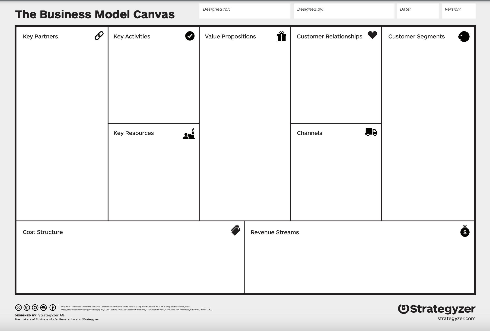

Note Challenge (4/5)

Evaluate - Feedback einholen

[toc]

**Ziele:**

* Ideen des Teams konkretisieren und greifbar machen ("Denken mit den Händen")
* Ziel ist die Entwicklung eines groben Modells, das die Innovation des Teams für Nutzer*innen erlebbar macht (Prototypen dürfen sich iterativ weiterentwickeln, sind zu Beginn eines Projekts grob, werden dann aber schrittweise verfeinert)
* Testen des entwickelten Prototyps mit Nutzern
* Getestet werden soll die dem Prototyp zugrundeliegende Hypothese bzw. die dem Prototyp zugrundeliegenden Prinzipien (d.h. den Kern der Idee testen)
* Die Erkenntnisse aus dem Testing können wieder in weiteren Iterationen des Prototyps integriert werden oder das Team in eine andere Phase (*Create*, oder *Evaluate*) führen
* Testen ähnelt der Beobachtung, der Prototyp ist ein Artefakt zur Kommunikation, um mehr über die Nutzer und deren Bedürfnisse zu erfahren

## Methode - Testen

Hier wird die der Idee zugrundeliegende Hypothese getestet. D.h. es soll herausgefunden werden, ob der Kern der Idee die Probleme der Nutzer*innen adressiert. Neben der Validierung der Idee ist Testen eine Möglichkeit, um mehr über die Bedürfnisse und Probleme der Zielgruppe zu erfahren.

## Methode - Business Model Canvas

Das Geschäftsmodell (Business Model) einer Idee / eines Startups / eines Unternehmens beschreibt, welche Ressourcen für die Entwicklung eines (digitalen) Produkts / einer Dienstleistung aufgebracht werden müssen, und wie diese an die Kunden gebracht werden soll.

Die folgende Abbildung zeigt einen Business-Model Canvas (Quelle: https://www.strategyzer.com/bmc_thank_you)

Das Team möchte die digitale Innovation "Grow" entwickeln, die es Personen mit wenig Kenntnissen über Pflanzen, und Personen, die selten zuhause sind, erlaubt, Pflanzen zu haben und zu pflegen. Dazu wird zunächst ein Sensor am gewünschten Ort für die Pflanze aufgestellt und ermittelt, welche Pflanzen für den Ort geeignet sind. Über eine App lassen sich die empfohlenen Pflanzen direkt bestellen. Sobald die Pflanze aufgestellt ist, wir der Sensor in die Erde gesteckt und bewässert und düngt die Pflanze automatisch. Ein ausgefüllter Business Model Canvas könnte wie folgt aussehen:

Mithilfe des Canvas hat sich das Team klargemacht, dass sie die Hardware nicht selbst herstellen wollen, und auch den Dünger und die Pflanzen nicht selbst vertreiben wollen. Lediglich der Sensor soll selbst entwickelt und vertrieben werden.

### So geht das Team vor:

**Material:** Whiteboard, PostIts, Template Business Model Canvas

**Ablauf**:

1. Team bereitet Whiteboard und Material vor

2. Team brainstormt gemeinsam die Felder des Business Model Canvas

## Iteration

Auch wenn die Phasen *Explore*, *Create*  und *Evaluate* hier in einer definierten Reihenfolge vorgestellt werden, ist Innovation ein iterativer Prozess. Jedes Team durchläuft alle Phasen mehrfach und passt die Ergebnisse der Phasen kontinuierlich an.

## Quelle

Dark Horse Innovation. (2016). Digital Innovation Playbook. Hamburg: Murmann Publishers GmbH.